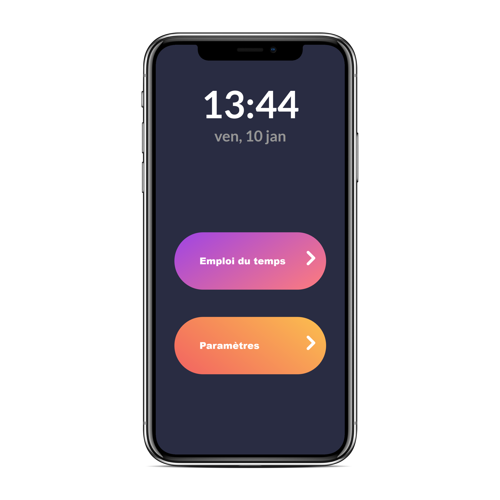
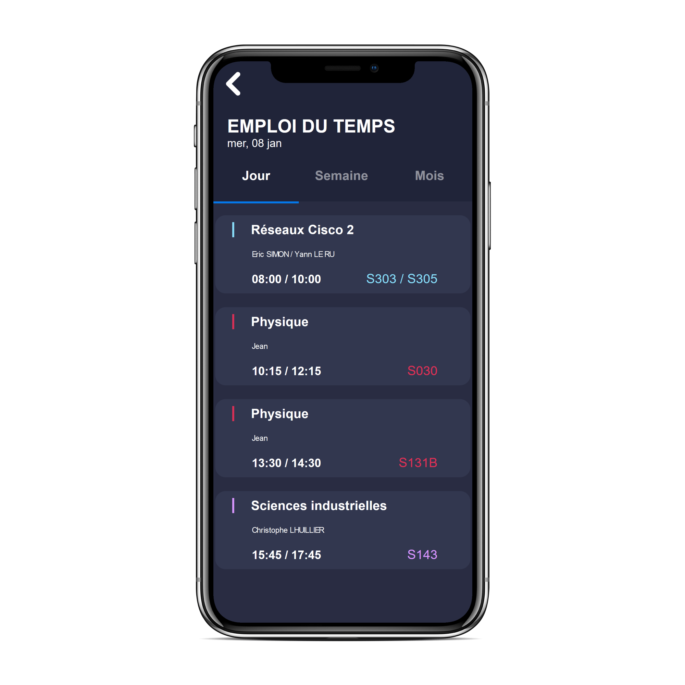

# EDTISEN
EDTISEN est une application PWA ([Progressive web app](https://fr.wikipedia.org/wiki/Progressive_web_app))
optimisée pour l'utilisation mobile qui permet aux étudiants de l'ISEN afin de consulter leur emploi du temps
sans passer par l'ENT.

Ce n'est pas une application officielle, EDTISEN est une application indépendante, gratuite et open-source.

   
Il est possible d'obtenir EDTISEN de deux manières différentes :

* APK

  Rendez-vous dans la section **Téléchargements** pour obtenir le code source de l'application
   
  afin de l'installer sur votre mobile.
   
  (Android uniquement)
  
* PWA

  La version web est disponible sur ce site : https://www.edtisen.xyz
        

 
L'interface d'EDTISEN est sobre et moderne et ne propose par un thème lumineux de base
 
afin de ravir les fans de thèmes sombres.
  
Il est possible de personnaliser les couleurs de chaque cours, disponible dans l'onglet paramètres

afin de choisir par cinq couleurs et pour chacune d'entre elle trois variantes afin d'avoir
un confort de naviguation et de repérer les cours rapidement et intuitivement.

         
# Activer l'agenda
Afin d'utiliser EDTISEN, vous devez rentrer votre login ISEN (le même pour vous connecter sur l'ENT).

Mais il faut aussi activer l'agenda. Pour celà il faudra vous rendre sur l'ENT, dans l'onglet **Mon compte** puis **Abonnement agenda**
et enfin cliquer sur *activer mon abonnement*

lien direct : [activer votre agenda](https://web.isen-ouest.fr/uPortal/p/abonnementAgenda.ctf3/max/render.uP)

# Téléchargements
* APK

  
  
  [EDTISEN sur le Play Store](https://play.google.com/store/apps/details?id=com.phonegap.edtisen)

* PWA

  Pour installer EDTISEN depuis le navigateur de votre mobile, il faut se rendre sur le site [https://edtisen.tools](https://edtisen.tools), puis cliquer sur ***Ajouter à l'écran d'acceuil***

# Suggestions
Si vous avez des suggestions, n'hésiter pas à nous contacter afin de nous soumettre votre idée.
Mail de contact : edtisen@gmail.com
